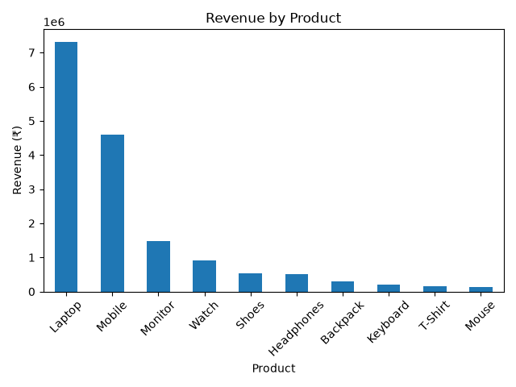
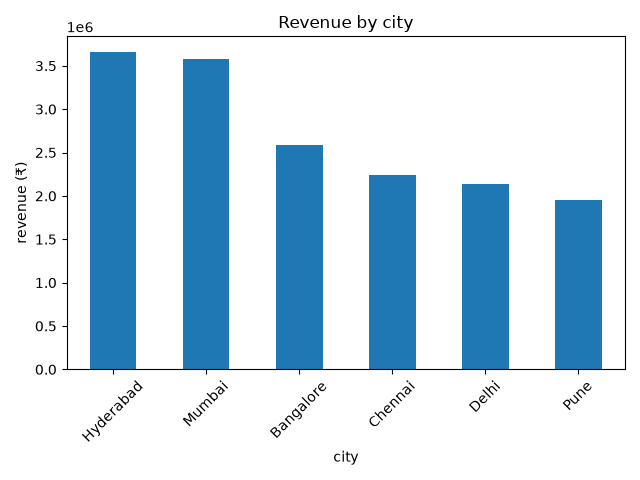
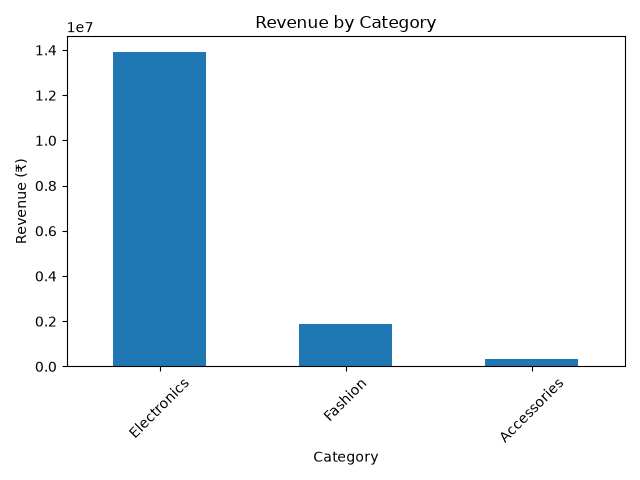

# E-Commerce Sales Analysis

## 📊 Project Overview

This project analyzes e-commerce sales data to identify revenue trends, top-performing products, cities, and categories.

The analysis was performed using Python and Pandas, with Matplotlib used for data visualization.

## 🛠️ Tools Used

- Python
- Pandas
- NumPy
- Matplotlib

## 📁 Dataset

The dataset contains 500 e-commerce orders with the following information:

- Order ID
- Date
- Product
- Category
- City
- Quantity
- Price

## 🔍 Analysis Performed

- Data inspection
- Missing value checking
- Duplicate checking
- Revenue calculation
- Revenue by product
- Revenue by city
- Revenue by category
- Monthly revenue analysis
- Data visualization

## 📈 Key Insights

- Total revenue: ₹1,61,47,700
- Top product: Laptop
- Laptop revenue: ₹73,15,000
- Top city: Hyderabad
- Hyderabad revenue: ₹36,56,800
- Top category: Electronics
- Electronics revenue: ₹1,39,10,000
- Best month: May 2026
- May revenue: ₹34,21,700

## 📊 Visualizations

### Revenue by Product



### Revenue by City



### Revenue by Category



### Monthly Revenue


## 🚀 Project Structure

```text
Sales Data Analysis
│
├── data
│   └── sales.csv
│
├── charts
│   ├── revenue_by_product.png
│   ├── revenue_by_city.png
│   ├── revenue_by_category.png
│   └── monthly_revenue.png
│
├── analysis.py
├── create_data.py
└── README.md
